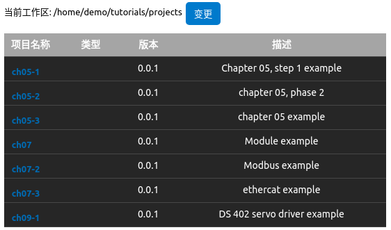

# Wasome PLC编程指南

Wasome WebIDE是一套现代的PLC编程开发IDE， 支持IEC61131-3编程语言，同时支持C、C++、Rust等多种计算机语言混合编程与调试。WasomeIDE基于最新的编程工具VSCODE开发， 提供功能丰富的编辑、编译、调试、模拟运行等功能。WasomeIDE目前支持在Ubuntu系统（18.04以上版本）上运行。

本文档的目标为帮助使用者使用WasomeIDE开发PLC应用程序。文档内容包含以下主要的组成部分：
-	快速入口
-	IEC61131-3语言编程基础
-	WasomeIDE系统函数库
-	使用ST语言开发最小项目
-	使用内部模块开发示例
-	使用实际MODBUS, ETHERCAT设备开发示例
-	开发基于PLCOpen运动控制
-	开发伺服驱动
-   上位机程序开发

# 使用示例

## 准备

下载本代码仓库到本地：
```
git clone https://github.com/wasome-plc/tutorials.git
```

安装好Wasome IDE，并打开。

## 设置工作区
在IDE中设置项目工作区到刚才下载代码仓库的目录下`projects`子目录：



## 打开示例项目
从上图中点击任意项目打开

# 示例项目

## Chapter 05:使用ST语言开发最小项目
在本章里我们将使用ST语言开发一个最小的PLC应用，这个应用不会使用到IO内存访问。这个例子用来练习ST语言的常用编程语法，包含三个进阶。

进阶一：

不使用IDE的图形界面编辑全局变量和任务，使用一个ST文件完成：
-	程序
-	基本的变量类型定义
-	主要语句方法（赋值，条件转跳，数据类型转换，循环）
-	打印
-	从IDE图形界面定义全局变量和任务

进阶二：

ST程序包含更多的语法：
-	数组变量定义
-	结构类型定义
-	函数定义
-	功能块定义

进阶三：

-	从ST程序定义资源与任务配置

