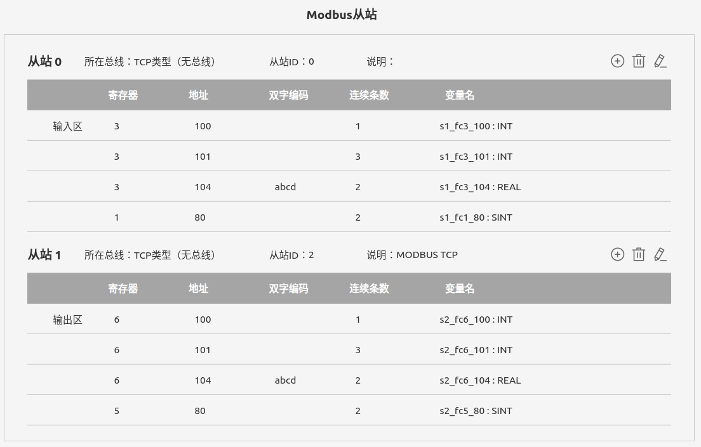

# CH07-5

## 测试原理


## 测试条件

1. 目标设备上安装了iagent软件包
2. 目标设备上安装了Python3以及modbus_tk。执行命令安装：
```
pip install modbus_tk
```
## 项目IDE的IO配置
在IDE中IO标准配置模式下的MODBUS从站都自动使用MODBUS（循环）方式来访问。项目配置了两个从站以及其寄存器如下图所示。  
  

另外请注意使用modbus-test-server作为从站时，使用的寄存器地址不能超过220，线圈地址不能超过2000。

## 测试工具test.py

在开始运行PLC应用或者源码调试之前，执行一下命令：
```
cd TOOLS
python3 test.py -p 1510
```
该命令将在本机启动两个MODDBUS TCP设备，从站ID均为1，IP地址和端口分别为：
- 127.0.0.1:1510
- 127.0.0.1:1511


## 部署和调试的网络设置

每次修改了IO配置后，启动调试或者配置，将会弹出以下窗口。界面中最初的TCP/总线选择，以及从站ID都使用了前面IDE中设置的内容，使用者可以根据部署的实际物理设备情况，使用填入设备的实际地址参数。如果前面test.py使用的`-p 1510`命令行参数，填写从站的IP地址和端口可以按照图片上内容填写。  


